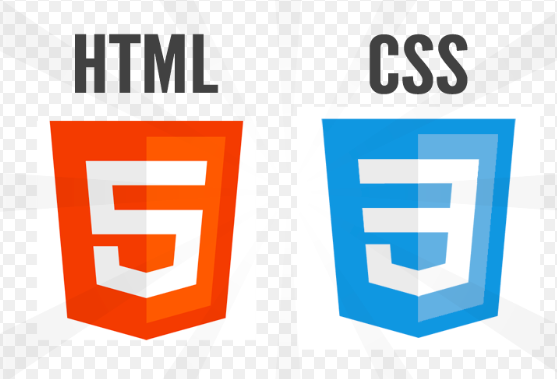

# Common-Core-Standards-Library-App
* **Front End on the app:**

* **Back End on the app:**

* **Database on the app:**

## Introduction video of the project: 
https://youtu.be/CbzyveLfOwI

* **Purpose of the app:** 
  Utilized various client-side, server-side frameworks and SQL by emphasizing database optimization including React,
Redux, Node, Express, PostgreSQL, CSS, HTML, and JavaScript.
 Developed an e-commerce app where teachers can shop online for class assignments, worksheets, coloring activities,
posters and curriculums based on the common core state standards. The state standards are pulled from CCSS API. Teachers are also allowed to become a seller to create and sell their own teaching materials. Teachers can reach out a variety of teaching materials created and used by other fellow teachers, add their items to the shop cart. They are able to make payment through Stripe Api.

## Register/Login: 
There are two user interfaces in the app. Regular buyers and sellers. When a user registers and logs in, he\she can make a search, filter products and purchase them. To be able to post and sell a product, user should be a seller. Header dropdown is adjusted based on the user type.

## Filter by Standards:
Since the main purpose of this app is searching class resources based on the common core standards, the majority of side bar filtering consists of different grades > Subjects > Standards. When user click the standard, all resources in regards to this standard will be displayed on the home page. Fol filterig side bar, I have utilized from rc-menu react package.

## Filter by Price and Resource Type:
There are 5 different type of resources and price ranges which are offered to users to make search for products. 

## Filter by Search Box:
When a seller post a product, he\she needs to enter some key words that is describing more about the resource as well as choosing standard and entering resource title. The search bar on the main page is designed to make search based on the these three components.

## Post a Resource to sell:
After becoming a seller, user can post a product by entering all required information and uploading a pdf format of resource. There is no limitation for number of pages being uploaded but it needs to be a pdf format. To be able to use pdf files, I saved all files being uploaded to a folder in the server side, used guid function to assign them a random and unique key, created a link for each pdf and sent this link to client side to display as response. For description part of form, I have utilized from rich text editor react package.

## Add a Product to The Cart and Checkout:
All pages with product info cart are including 'Add to Cart' button to make shopping accessible in all different levels of searching. User can add the item to his/her cart, remove the item from cart or checkout by making payment. I have used Stripe Api for payment system.

## Leave a Review and Rate Product After Purchasing:
After making purchase, the app takes user to 'my purchases' page where user can see all items he/she purchased, print them whenever he/she wants, rate or leave a review based on the experience. Once the review is left, it is displayed on the product details page, given rating is calculated to find the average rating of the product.

